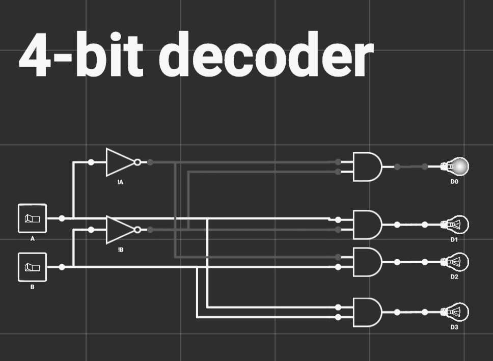

## Цифровой дешифратор (декодер)

### Применение
Декодер используют, когда нужно обращаться к различным цифровым устройствам, и при этом номер устройства — его адрес — представлен двоичным кодом.
Дешифраторы выпускаются в виде отдельных микросхем или используются в составе более сложных микросхем. В настоящее время десятичные или восьмеричные дешифраторы используются в основном как составная часть других микросхем, таких как мультиплексоры, демультиплексоры, ПЗУ или ОЗУ.

### Устройство
Декодер представляет собой схему, которая позволяет выбирать одну из 2n выходных линий, где n - количество линий управления, которые совместно образуют n-разрядное число, то есть номер выходной линии. На рис. 1 представлен пример 4-битного декодера, у которого две линии управления (A и B) кодируют 4-разрядное число, которое указывает, какую из 4 выходных линий (D0 - D3) "выбрать".
<section>
    
    

        Рис. 1.
        Учебная схема 4-битного декодера
    

</section>

Исходя из выше изложенной схемы (рис. 1) можно представить следующую простую таблицу истинности:
| A | B |     Output     |
|:-:|:-:|:--------------:|
| 0 | 0 | D0  |
| 0 | 1 | D1  |
| 1 | 0 | D2  |
| 1 | 1 | D3  | 

### Схематическое обозначение
<section>
    
    

        Рис. 2.
        Схематическое обозначение дешифратора (декодера) 3-8 
    

</section>

### Список использованных источников
* [[1]](../references.md/#references-ru);
* [[5]](../references.md/#references-ru);
* [[6]](../references.md/#references-ru);
* [[7]](../references.md/#references-ru);

