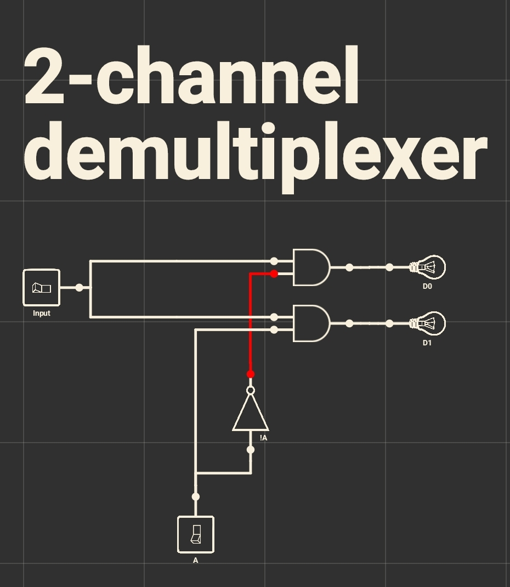

## Цифровой демультиплексор

### Применение
Демультиплексоры используются в цифровых системах управления для выбора одного сигнала из общего потока сигналов, в преобразователях последовательного сигнала в параллельный, тем самым выполняя функцию обратную [мультиплексору](./multiplexer.md).

### Устройство
Демультиплексор представляет собой схему, которая соединяет единственный входной сигнал с одним из 2n выходов в зависимости от значений сигналов в n линиях управления. На рис. 1 изображена схема двувыходового демультиплексора. Одна линия управления А кодирует 1-разрядное число, которое указывает, через какую из двух выходных линий D0 или D1 должен проходить сигнал точки входа (Input).
<section>
    
    

        Рис. 1.
        Учебная схема 2-канального демультиплексора
    

</section>

Демультиплексор позволяет выбирать на какой из выходов подать входной сигнал. Также его можно использовать в качестве преобразователя последовательного кода в параллельный, если поочерёдно переключать линии управления таким образом, чтобы попорядку перебрать все двоичные числа от наименьшего к большему (в 2-битном - от 0 до 1, в 4-битном - от 00 до 11, в 8-битном - от 000 до 111 и т.д.).

Исходя из выше изложенной схемы (рис. 1) можно представить следующую простую таблицу истинности:
| A |     Output     |
|:-:|:--------------:|
| 0 |  D0 |
| 1 |  D1 |

### Схематическое обозначение
Схематическим обозначением демультиплексора является равнобедренная трапеция с более длинной параллельной стороной, содержащей входные контакты, и короткой параллельной стороной, содержащей выходной контакт (рис. 2).
<section>
    
    

        Рис. 2.
        Схематическое обозначение демультиплексора 
    

</section>

### Список использованных источников
* [[1]](../references.md/#references-ru);
* [[3]](../references.md/#references-ru);
* [[4]](../references.md/#references-ru).