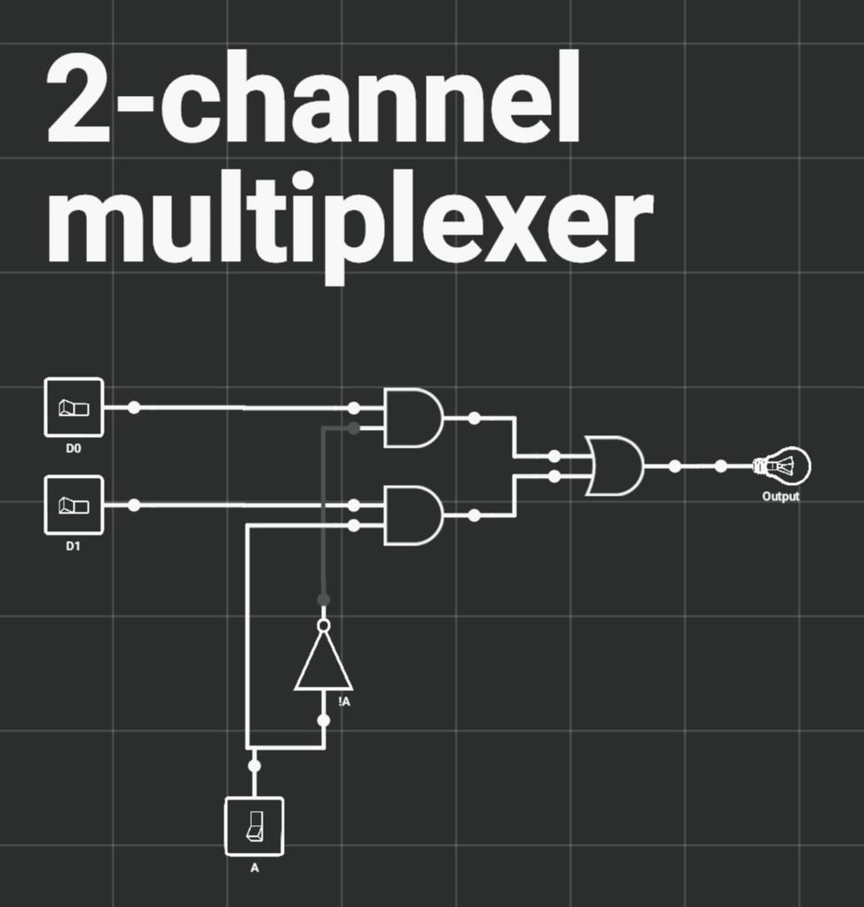

## Цифровой мультиплексор

### Применение
Мультиплексоры широко используются в различных областях, где требуется коммутация и выбор сигналов. Одно из основных применений мультиплексоров - это в цифровых системах связи, где они используются для мультиплексирования нескольких сигналов на одной линии передачи данных. Это позволяет повысить эффективность использования канала связи и увеличить пропускную способность системы. 

Мультиплексоры также широко применяются в цифровых системах обработки сигналов, таких как аудио и видео обработка. Они позволяют выбирать нужные сигналы для дальнейшей обработки или передачи.

Кроме того, мультиплексоры используются в компьютерных сетях для коммутации сетевых пакетов и управления трафиком.

Противоположностью мультиплексору выступает [демультиплексор](./demultiplexer.md).

### Устройство
На цифровом логическом уровне мультиплексор представляет собой схему с 2n входами, одним выходом и n линиями управления, которые позволяют выбрать один из входов. Выбранный вход соединяется с выходом. На рис. 1 изображена схема двувходового мультиплексора. Одна линия управления А кодирует 1-разрядное число, которое указывает, какая из двух входных линий D0 и D1 должна поступать на выход (Output).
<section>
    
    

        Рис. 1. Учебная схема 2-канального мультиплексора
    

</section>

Мультиплексор позволяет выбирать какой из входных сигналов подать на выход. Также его можно использовать в качестве преобразователя параллельного кода в последовательный, если поочерёдно переключать линии управления таким образом, чтобы попорядку перебрать все двоичные числа от наименьшего к большему (в 2-битном - от 0 до 1, в 4-битном - от 00 до 11, в 8-битном - от 000 до 111 и т.д.).

Исходя из выше изложенной схемы (рис. 1) можно представить следующую простую таблицу истинности:
| A |     Output     |
|:-:|:--------------:|
| 0 |  D0 |
| 1 |  D1 |

### Схематическое обозначение
Схематическим обозначением мультиплексора является равнобедренная трапеция с более длинной параллельной стороной, содержащей входные контакты, и короткой параллельной стороной, содержащей выходной контакт (рис. 2). 
<section>
    
    

        Рис. 2.
        Схематическое обозначение мультиплексора 
    

</section>

### Список использованных источников
* [[1]](../references.md/#references-ru);
* [[2]](../references.md/#references-ru);
* [[3]](../references.md/#references-ru).